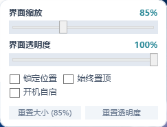
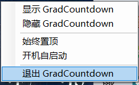

# GradCountdown

> **A tiny Windows desktop widget counting down the days of graduate school.**  
> 一个轻量、简洁的 Windows 研究生毕业倒计时桌面小组件。

[](https://github.com/suit-debug/GradCountdown/releases/latest)
[](LICENSE)


---

## ⬇️ Download

[**Download the latest Windows x64 release →**](https://github.com/suit-debug/GradCountdown/releases/latest)

Download the ZIP, extract it, and run `GradCountdown.exe`.

The official Windows release is self-contained, so no separate .NET installation is required.

---

## 📸 Screenshots

<table>
  <tr>
    <td align="center">
      <b>Graduation Countdown</b><br>
      
    </td>
    <td align="center">
      <b>Elapsed Days</b><br>
      
    </td>
  </tr>
  <tr>
    <td align="center">
      <b>Customization</b><br>
      
    </td>
    <td align="center">
      <b>System Tray</b><br>
      
    </td>
  </tr>
</table>

---

## ✨ Features

- 🎓 **Graduation countdown** — Displays remaining days toward graduation
- 📚 **Elapsed graduate-school days** — Displays days passed since enrollment
- 🕒 **Windows system date** — Automatically calculates dates from local system clock
- 🔄 **Mode switching** — Left click the card to toggle between the two display modes
- 🖱️ **Draggable widget** — Drag and place the widget anywhere on the desktop
- 🔍 **Adjustable UI scale** — Proportional scaling from 60% to 130% (step 5%, default 85%)
- 🌫️ **Adjustable opacity** — Opacity from 60% to 100% (default 95%) with one-click reset
- 🔒 **Position lock** — Prevent accidental movement while preserving click interaction
- 📌 **Optional Always-on-Top** — Keep the widget pinned above other windows (default OFF)
- 🚀 **Optional Windows auto-start** — User-level registry startup (`HKCU`, default OFF)
- 🖥️ **System tray controls** — Show, hide, and manage the widget from the system tray
- 1️⃣ **Single-instance protection** — Duplicate launches restore the active widget
- 💾 **Local settings persistence** — Coordinates and preferences saved to `%LOCALAPPDATA%\GradCountdown`
- 🌐 **Fully offline** — No network requests, no telemetry, complete local privacy

---

## 🖱️ Usage

- **Left click** — Switch between graduation countdown and elapsed days
- **Drag** — Move the widget across the screen
- **⋯ menu** — Adjust scale, opacity, position lock, Always-on-Top, and auto-start
- **System tray** — Show, hide, or exit GradCountdown

---

## 📅 Default Dates

- **Start Date:** `2025-09-01`
- **Graduation Date:** `2028-07-01`

The dates can be changed in the project configuration (`GradCountdown/Services/CountdownService.cs`) for your own graduation, exam, anniversary, or deadline countdown.

---

## ⏳ Date Handling

GradCountdown uses the local Windows system date:

- **Before the start date** → `尚未入学` (Not enrolled yet)
- **Graduation day** → `0`
- **After graduation** → `已毕业` (Graduated)

---

## 💻 Requirements

- Windows x64
- Developed and tested on Windows 10 22H2 (Build 19045)

The downloadable Release build is self-contained.

---

## 🛠️ Build from Source

### Requirements

- .NET 10 SDK
- Windows (WPF support)

### Build

```powershell
dotnet build GradCountdown.sln -c Release
```

### Publish

```powershell
dotnet publish GradCountdown\GradCountdown.csproj `
  -c Release `
  -r win-x64 `
  --self-contained true `
  -p:DebugType=None `
  -p:DebugSymbols=false `
  -o .\publish
```

---

## 📁 Project Structure

```text
GradCountdown/
├─ GradCountdown/          # WPF desktop application
├─ GradCountdown.Tests/    # Date logic tests & icon generator
├─ screenshots/            # Application screenshots
├─ docs/                   # Design reference
├─ README.md
├─ LICENSE
└─ GradCountdown.sln
```

---

## 🔐 Privacy

GradCountdown runs entirely on your local machine:

- No account required
- No telemetry
- No cloud sync
- No network requests

---

## 📄 License

This project is licensed under the [MIT License](LICENSE).
